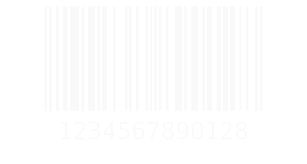

# Лабораторная работа QR и штрих коды

**QR-код** (англ. quickresponse — быстрый отклик) — матричный код, разработанный и 
представленный японской компанией "Denso-Wave" в 1994 году. QR-код является двумерным 
представлением обычного штрихкода, помещаемого практически на любую производимую продукцию.
QR символизирует мгновенный доступ к информации, хранимой в коде. Закодированная информация
может состоять из данных любого типа (например, двоичных, буквенно-цифровых символов или 
символов Кандзи(китайско-японские иероглифы)).
 
--
**Штриховой код, или штрих-код** - это машиночитаемый символ, содержащий закодированную информацию
о характеристиках произведенной продукции и позволяющий осуществлять ее автоматизированную 
идентификацию.

Внешне штрих-код представляет собой комбинацию темных полосок (штрихов) и разделяющих их 
светлых полосок различной толщины.
Каждая единица товара идентифицируется с помощью штрихового и цифрового кода.

## Значение штрих кода

  

- Первые 2-3 цифры - это префикс национальной организации или ее код. Их присваивает EAN International;

- Следующие S-1 цифр - это код изготовителя (предприятия);

- В целом первые 7-9 цифр, включая префикс,- это регистрационный номер предприятия внутри 
национальной организации;

- Следующая группа цифр - это порядковый номер продукции внутри предприятия;

- Последняя 13-я цифра - контрольное число, которое предназначается для проверки 
правильности считывания штрихового кода сканером (считывающим устройством).

## Проверка правильности составления штрих-кода

Подтвердить правильность составления ШК можно и без компьютера путем расчета контрольной цифры кода
семейства EAN-13 в определенной последовательности.

 1. Складываем цифры, стоящие на четных позициях кода.
 2. Результат умножаем на три.
 3. Складываем цифры, стоящие на нечетных позициях кода.
 4. Складываем результаты 2-го и 3-го действий.
 5. Контрольное число представляет собой разность между окончательной суммой и ближайшим к ней числом, кратным 10.

## Количество символов, которое можно закодировать в QR-код

**Максимальное число символов**, которое можно внести в QR-код (версия 40,
177×177 модулей):

- Цифры — 7089; 
- Цифры и буквы латинского алфавита — 4296;
- Иероглифы — 1817;
- Двоичный код — 2953 байта (следовательно, около 2953 букв кириллицы в кодировке 
windows-1251 или 1450 букв кириллицы в utf-8).

Если выражать размеры в битах — 10 бит на 3 цифры и 11 бит на 2 алфавитно-цифровых символа.

В данной работе я использовала **QR код 3 версии** (29×29 модулей), которым можно закодировать:

- Цифры — 127; 
- Цифры и буквы латинского алфавита — 77;
- Иероглифы — 32;
- Двоичный код — 53 байта.

## Уровни коррекции ошибок

- L-уровень коррекции. При его использовании можно восстановить 7% информации.
- М-уровень коррекции. Восстановление 15% информации.
- О-уровень коррекции. Восстановление 25% информации.
- Н-уровень коррекции. Восстановление 30% информации.

Для исправления ошибок используется алгоритм Рида-Соломона.
Данный алгоритм используется как при создании QR-кода, так и при его дешифрации.

## Преимущества QR-кода

- Больше данных, чем в штрих-коде
- Меньше ошибок
- Легко считывать
- Легко печатать
- Повышенная надежность

## Недостатки QR-кода
- Необходимо быть уверенным, что адресат сможет его прочесть;
- Вмещает в себя относительно мало информации, например, закодировать целую книгу в 
один стандартный QR-код не представляется возможным;
- QR-код является общедоступной технологией, следовательно, нельзя хранить важную 
информацию в виде QR-кода, так как код не предоставляет соответствующий уровень защиты 
информации.

## Анализ стойкости

В процессе анализа стойкости я проводила различные преобразования над изображениями 
кодов:

- увеличивала яркость изображения:

     пример qr кода, который еще считывается

     пример qr кода, который уже не считывается

     пример штрих кода, который еще считывается

     пример штрих кода, который уже не считывается

- поворачивала код на различные углы:

     пример qr кода, который еще считывается

     пример qr кода, который уже не считывается

    Предельное значение поворота 15 градусов (не включая это значение) от прямого угла
(т.е. +-15 градусов от поворота на 0, 90, 180, 270)

     пример штрих кода, который еще считывается

     пример штрих кода, который уже не считывается

    Предельное значение поворота 45 градусов (не включая это значение) от прямого угла
(т.е. +-45 градусов от поворота на 0, 90, 180, 270)

- отзеркаливала:

     по вертикали

     и горизонтали

     по вертикали

     и горизонтали

    В результате преобразований код декодировался во всех случаях правильно

- размывала:

     пример qr кода, который еще считывается

     пример qr кода, который уже не считывается

    При ядре размытия в 11 пикселей (для изображения 370×370) код перестает считываться

     пример штрих кода, который еще считывается

     пример штрих кода, который уже не считывается

    При ядре размытия в 6 пикселей (для изображения 523×280) код перестает считываться

- вырезала части:

     пример qr кода, который еще считывается

     пример qr кода, который уже не считывается

     пример штрих кода, который еще считывается

     пример штрих кода, который уже не считывается

- закрашивала куски кода в разных углах:

     пример qr кода, который еще считывается

     пример qr кода, который уже не считывается
    
     пример штрих кода, который еще считывается

     пример штрих кода, который уже не считывается
